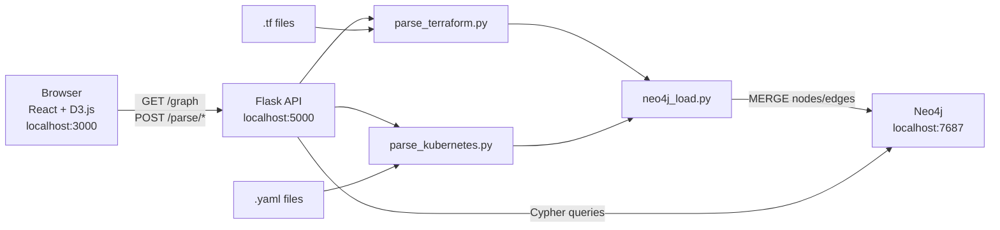

# InfraGraph — Infrastructure Dependency Visualizer


Upload your Terraform and Kubernetes files and instantly see a live, interactive dependency graph — all running locally.

InfraGraph parses `.tf` and `.yaml` files, extracts every resource and its dependencies, stores the graph in Neo4j, and renders it as a force-directed SVG graph in the browser. Nodes are sized by connectivity, colored by resource type, and fully interactive — click to inspect, drag to rearrange, filter by type.

---

## Architecture



---

## Prerequisites

- [Docker Desktop](https://www.docker.com/products/docker-desktop/) (includes Docker Compose v2)
- Git

---

## Quick Start

```bash
git clone https://github.com/<your-org>/InfraGraph.git
cd InfraGraph
cp .env.example .env
docker compose up --build
```

| Service | URL | Credentials |
|---|---|---|
| App | http://localhost:3000 | — |
| API | http://localhost:5000 | — |
| Neo4j Browser | http://localhost:7474 | neo4j / password |

On first start, the graph is pre-populated with seed data: 21 resources across a realistic AWS environment and a Kubernetes application (19 dependency edges).

To stop and remove all data:
```bash
docker compose down -v
```

---

## What You Can Do

- **Upload files** — drag-and-drop `.tf`, `.yaml`, or `.zip` onto the left sidebar; the graph updates instantly
- **Explore the graph** — zoom (scroll), pan (drag background), drag individual nodes to rearrange
- **Inspect a resource** — click any node to open the detail panel with all properties
- **Filter by type** — toggle resource types on/off using the sidebar checkboxes
- **Reset** — clear the entire graph and start fresh with the Reset button in the top bar

---

## Supported Resource Types

### Terraform

| Provider | Types |
|---|---|
| AWS | `aws_vpc`, `aws_subnet`, `aws_security_group`, `aws_instance`, `aws_s3_bucket`, `aws_iam_role`, `aws_iam_policy`, `aws_lb`, `aws_db_instance`, `aws_lambda_function`, `aws_cloudfront_distribution` |
| GCP | `google_compute_instance`, `google_storage_bucket` |
| Azure | `azurerm_resource_group`, `azurerm_virtual_network` |
| Meta | `variable`, `output`, `data` (data sources) |

### Kubernetes

`Deployment`, `Service`, `ConfigMap`, `Secret`, `Ingress`, `StatefulSet`, `DaemonSet`, `Job`, `CronJob`, `HorizontalPodAutoscaler`, `PersistentVolumeClaim`, `ServiceAccount`

Unknown resource kinds (CRDs, operators) are parsed as nodes without dependency inference.

---

## How Dependency Inference Works

### Terraform — Implicit (interpolation references)

Any attribute value in a resource body that references another resource generates an edge:

```hcl
resource "aws_subnet" "private" {
  vpc_id = aws_vpc.main.id   # <- implicit edge: aws_subnet.private -> aws_vpc.main
}
```

The parser walks all string values recursively, matching the pattern
`(aws_|google_|azurerm_|...)_<type>.<name>` to extract edges.

### Terraform — Explicit (`depends_on`)

```hcl
resource "aws_iam_role" "app_role" {
  depends_on = [aws_s3_bucket.uploads]   # <- explicit edge
}
```

### Kubernetes

| Rule | Condition | Edge |
|---|---|---|
| Service → Deployment | `service.spec.selector` is a subset of pod template labels | `Service` → `Deployment` |
| Deployment → ConfigMap | `envFrom[].configMapRef` or `volumes[].configMap` | `Deployment` → `ConfigMap` |
| Deployment → Secret | `envFrom[].secretRef` or `volumes[].secret` | `Deployment` → `Secret` |
| Ingress → Service | `spec.rules[].http.paths[].backend.service.name` | `Ingress` → `Service` |

All edges are namespace-scoped — no cross-namespace relationships are inferred.

---

## API Reference

| Method | Path | Request | Response |
|---|---|---|---|
| `POST` | `/parse/terraform` | `multipart/form-data`, field `file` (.tf or .zip) | `{node_count, edge_count}` |
| `POST` | `/parse/kubernetes` | `multipart/form-data`, field `file` (.yaml/.yml or .zip) | `{node_count, edge_count}` |
| `GET` | `/graph` | — | `{nodes: [...], edges: [...]}` |
| `GET` | `/graph/resource/{id}` | path param (URL-encoded) | `{nodes, edges}` — depth-2 subgraph |
| `GET` | `/graph/stats` | — | `{node_count, edge_count, most_connected, isolated_count, circular_dependencies}` |
| `POST` | `/graph/reset` | — | `{deleted: N}` |
| `GET` | `/health` | — | `{status: "ok"}` |

Resource IDs:
- Terraform: `{type}.{name}` — e.g. `aws_s3_bucket.uploads`
- Kubernetes: `{Kind}/{namespace}/{name}` — e.g. `Deployment/default/app`

---

## Development Setup (without Docker)

You need a running Neo4j instance. The easiest way:

```bash
docker run -p 7474:7474 -p 7687:7687 \
  -e NEO4J_AUTH=neo4j/password \
  -e NEO4J_PLUGINS='["apoc"]' \
  neo4j:5
```

**Backend:**
```bash
cd backend
pip install -r requirements.txt
export NEO4J_URI=bolt://localhost:7687
export NEO4J_USERNAME=neo4j
export NEO4J_PASSWORD=password
export NEO4J_DATABASE=neo4j
python -m flask --app app.main:create_app run
# API available at http://localhost:5000
```

**Frontend:**
```bash
cd frontend
npm install
npm run dev
# App available at http://localhost:5173 (proxies /parse and /graph to localhost:5000)
```

**Load seed data manually:**
```bash
SEED_ON_START=true python execution/seed_loader.py
```

---

## Running Tests

```bash
pytest backend/tests/ -v
```

27 tests covering both parsers — no live services required. Tests verify resource counts, edge inference rules (explicit and implicit), deduplication, cross-namespace isolation, and error handling.

```
backend/tests/
├── fixtures/
│   ├── sample.tf          # 12 resources, 9 edges
│   └── sample-k8s.yaml    # 7 resources, 4 edges
├── test_terraform_parser.py   # 13 tests
└── test_kubernetes_parser.py  # 14 tests
```

---

## Project Structure

```
InfraGraph/
├── docker-compose.yml          # Full local stack: neo4j + backend + frontend
├── .env.example                # Environment variable template
├── spec.md                     # Full project specification
│
├── directives/                 # Layer 1: SOPs governing each component
│   ├── terraform_parser.md
│   ├── kubernetes_parser.md
│   ├── neo4j_graph.md
│   ├── api_server.md
│   ├── frontend.md
│   ├── docker_compose.md
│   └── ci_cd.md
│
├── execution/                  # Layer 3: Deterministic Python scripts
│   ├── parse_terraform.py      # HCL2 parser — CLI + importable module
│   ├── parse_kubernetes.py     # YAML parser — CLI + importable module
│   ├── neo4j_load.py           # Loads parsed JSON into Neo4j
│   └── seed_loader.py          # Auto-seeds Neo4j on container start
│
├── backend/                    # Flask REST API
│   ├── Dockerfile
│   ├── requirements.txt
│   └── app/
│       ├── main.py             # App factory, blueprints, CORS
│       ├── routes/             # parse.py, graph.py
│       ├── parsers/            # Thin wrappers over execution/ scripts
│       ├── graph/              # neo4j_client.py, queries.py
│       └── models/             # Pydantic models: Resource, Edge, GraphData, GraphStats
│   └── tests/
│       ├── fixtures/           # sample.tf, sample-k8s.yaml
│       ├── test_terraform_parser.py
│       └── test_kubernetes_parser.py
│
├── frontend/                   # React + TypeScript + D3.js
│   ├── Dockerfile
│   ├── nginx.conf              # SPA fallback + API proxy
│   └── src/
│       ├── App.tsx             # Root layout
│       ├── components/         # GraphCanvas, UploadZone, NodeDetailPanel, FilterControls, StatsBar
│       ├── hooks/useGraph.ts   # Central state: nodes, edges, selectedNode, uploads
│       ├── types/graph.ts      # TypeScript interfaces + NODE_COLORS
│       └── api/client.ts       # Typed fetch wrappers
│
├── seed/                       # Demo infrastructure data
│   ├── main.tf                 # AWS VPC, subnets, SGs, ALB, EC2, S3, IAM
│   ├── variables.tf
│   └── seed-k8s.yaml           # Deployment, Service, ConfigMap, Secret, Ingress
│
└── .github/
    └── workflows/ci.yml        # lint → (test + build) in parallel
```

---

## CI/CD

GitHub Actions runs on every push to `main`/`develop` and on pull requests:

```
lint ──┬──► test   (pytest — no live services)
       └──► build  (docker compose build — validates Dockerfiles)
```

All three jobs must pass before merging.

---

## Contributing

1. Fork the repository
2. Create a feature branch: `git checkout -b feature/my-change`
3. Make your changes — update the relevant directive in `directives/` if you change parsing or API behaviour
4. Run tests: `pytest backend/tests/ -v`
5. Check lint: `flake8 backend/ execution/ --max-line-length=120` and `cd frontend && npx tsc --noEmit`
6. Open a pull request — CI must pass

---

## License

MIT
