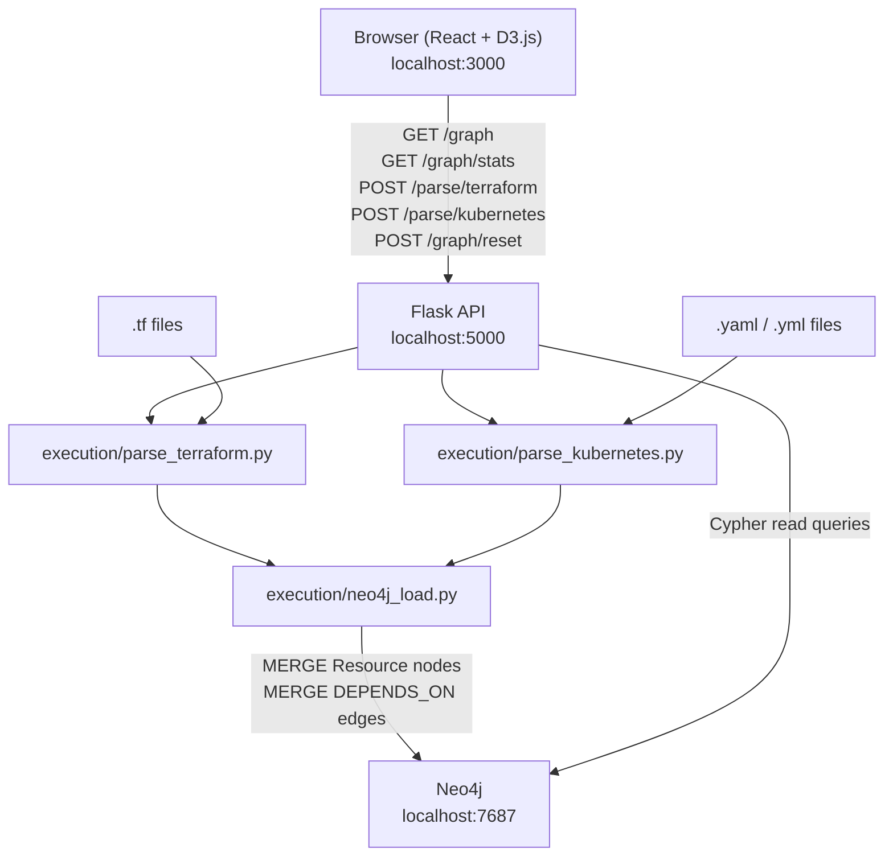

# InfraGraph — Project Specification

## 1. Project Overview and Goals

InfraGraph is a fully local, open-source infrastructure dependency visualizer for platform and DevOps engineers. It parses Terraform (`.tf`) and Kubernetes YAML files, extracts all resources and their dependency relationships, stores the resulting graph in Neo4j, and renders it as an interactive, force-directed dependency graph in the browser.

**Problem it solves**: Engineers tracing infrastructure dependencies manually — reading dozens of `.tf` files and YAML manifests to understand what depends on what — is slow and error-prone. InfraGraph replaces that with an instant visual graph after a single file upload.

**Goals**:
- Parse both explicit (`depends_on`) and implicit (interpolation reference) Terraform dependencies
- Parse Kubernetes relationships inferred from label selectors, `envFrom`, volume mounts, and Ingress backends
- Render a live, interactive force-directed graph with zoom, pan, node filtering, and shortest-path highlighting
- Require zero cloud account — everything runs on `localhost` via Docker Compose

---

## 2. Architecture Diagram



**Layer mapping**:
- `Browser` = React frontend (Vite build served by nginx on port 3000)
- `Flask API` = Layer 2 orchestration surface + Layer 3 entry point
- `execution/*.py` = Layer 3 deterministic execution scripts
- `Neo4j` = persistent graph store (port 7687 Bolt, 7474 browser)

---

## 3. Technology Stack

| Component | Library / Tool | Version | Purpose |
|---|---|---|---|
| Frontend framework | React | ^18 | UI component tree |
| Frontend build | Vite | ^5 | Dev server + production build |
| Frontend language | TypeScript | ^5 | Type safety |
| Graph visualization | D3.js | ^7 | Force-directed SVG graph |
| Backend framework | Flask | ^3.0 | REST API |
| Backend language | Python | 3.11 | Execution scripts + API |
| CORS | flask-cors | ^4.0 | Allow localhost:3000 → localhost:5000 |
| Terraform parsing | python-hcl2 | ^4.0 | Parse HCL2 `.tf` files into Python dicts |
| Kubernetes parsing | PyYAML | ^6.0 | Parse multi-document YAML |
| Data validation | pydantic | ^2.0 | Resource/Edge/Stats models with type hints |
| Neo4j driver | neo4j | ^5.0 | Official Python driver, parameterized Cypher |
| Env management | python-dotenv | ^1.0 | Load `.env` in execution scripts |
| File uploads | werkzeug | ^3.0 | Multipart file handling in Flask |
| Graph DB | Neo4j | 5 (Docker) | Store `:Resource` nodes and `:DEPENDS_ON` edges |
| Container orchestration | Docker Compose | v2 | Local multi-service stack |
| CI/CD | GitHub Actions | — | Lint, test, build on push/PR |
| Test framework | pytest | ^8.0 | Backend unit tests |
| Python linter | flake8 | ^7.0 | Backend lint in CI |
| JS linter | ESLint | ^8 | Frontend lint in CI |

---

## 4. Data Model

### Node — label `:Resource`

| Property | Type | Description |
|---|---|---|
| `id` | string | Unique identifier. Format: `{type}.{name}` for Terraform; `{Kind}/{namespace}/{name}` for Kubernetes |
| `name` | string | Resource name as declared in the IaC file |
| `type` | string | Resource type string (see resource types table below) |
| `file` | string | Relative path to source file |
| `line_number` | integer | Line number of resource declaration (0 if unavailable) |
| `source` | string | `"terraform"` or `"kubernetes"` |

### Edge — type `:DEPENDS_ON`

- Directed: `(dependent)-[:DEPENDS_ON]->(dependency)`
- No additional properties
- Semantics: "the source resource depends on the target resource"

### Resource Types

**Terraform**:
`aws_vpc`, `aws_subnet`, `aws_security_group`, `aws_instance`, `aws_s3_bucket`, `aws_iam_role`, `aws_iam_policy`, `aws_lb`, `aws_lb_listener`, `aws_db_instance`, `google_compute_instance`, `google_storage_bucket`, `azurerm_resource_group`, `azurerm_virtual_network`, `data` (data sources), `variable`, `output`, `module`

**Kubernetes**:
`Deployment`, `Service`, `ConfigMap`, `Secret`, `Ingress`, `StatefulSet`, `DaemonSet`, `Job`, `CronJob`, `ServiceAccount`, `PersistentVolumeClaim`, `HorizontalPodAutoscaler`

---

## 5. API Contract

### POST /parse/terraform
- **Request**: `multipart/form-data`, field `file` — accepts `.tf` file or `.zip` of `.tf` files
- **Response 200**: `{"node_count": N, "edge_count": M}`
- **Response 400**: `{"error": "No file provided"}` or `{"error": "Unsupported file type"}`
- **Response 500**: `{"error": "<parse error message>"}`

### POST /parse/kubernetes
- **Request**: `multipart/form-data`, field `file` — accepts `.yaml`/`.yml` file or `.zip`
- **Response 200**: `{"node_count": N, "edge_count": M}`
- **Response 400**: `{"error": "No file provided"}`
- **Response 500**: `{"error": "<parse error message>"}`

### GET /graph
- **Request**: no params
- **Response 200**:
  ```json
  {
    "nodes": [{"id": "aws_s3_bucket.uploads", "name": "uploads", "type": "aws_s3_bucket", "file": "main.tf", "line_number": 12, "source": "terraform"}],
    "edges": [{"source": "aws_iam_role.app_role", "target": "aws_s3_bucket.uploads"}]
  }
  ```

### GET /graph/resource/{id}
- **Request**: path param `id` (URL-encoded if needed)
- **Response 200**: same shape as `GET /graph`, scoped to depth-2 subgraph around the given node
- **Response 404**: `{"error": "Resource not found"}`

### GET /graph/stats
- **Response 200**:
  ```json
  {
    "node_count": 12,
    "edge_count": 9,
    "most_connected": {"id": "aws_vpc.main", "name": "main", "degree": 4},
    "isolated_count": 2,
    "circular_dependencies": 0
  }
  ```

### POST /graph/reset
- **Response 200**: `{"deleted": N}`

### GET /health
- **Response 200**: `{"status": "ok"}`

---

## 6. Dependency Inference Rules

### Terraform

**Explicit dependencies** (parsed from HCL `depends_on` attribute):
```hcl
resource "aws_iam_role" "app_role" {
  depends_on = [aws_s3_bucket.uploads]
}
```
→ Edge: `aws_iam_role.app_role` → `aws_s3_bucket.uploads`

**Implicit dependencies** (interpolation references in attribute values):
- Walk all string values recursively in a resource's body
- Match pattern: `(aws_|google_|azurerm_|kubernetes_|helm_)[a-z_]+\.[a-zA-Z0-9_-]+`
- First segment = resource type, second segment = resource name
- Example: `subnet_id = aws_subnet.private.id` → Edge: current resource → `aws_subnet.private`

**Data source references**:
- Match pattern: `data\.[a-z_]+\.[a-zA-Z0-9_-]+` in attribute values
- Data source ID format: `data.{type}.{name}`
- Example: `arn = data.aws_iam_policy.readonly.arn` → Edge: current resource → `data.aws_iam_policy.readonly`

**Deduplication**: build edge set as Python `set` of `(source_id, target_id)` tuples; skip if `source == target`.

### Kubernetes

**Service → Deployment** (label selector match):
- `service.spec.selector` must be a non-empty subset of `deployment.spec.template.metadata.labels`
- Both must be in the same namespace
- Edge: `Service/{ns}/{name}` → `Deployment/{ns}/{name}`

**Deployment → ConfigMap** (environment / volume references):
- `spec.template.spec.containers[].envFrom[].configMapRef.name`
- `spec.template.spec.volumes[].configMap.name`
- Edge: `Deployment/{ns}/{name}` → `ConfigMap/{ns}/{ref_name}`

**Deployment → Secret** (environment / volume references):
- `spec.template.spec.containers[].envFrom[].secretRef.name`
- `spec.template.spec.volumes[].secret.secretName`
- Edge: `Deployment/{ns}/{name}` → `Secret/{ns}/{ref_name}`

**Ingress → Service** (backend reference):
- `spec.rules[].http.paths[].backend.service.name`
- Edge: `Ingress/{ns}/{name}` → `Service/{ns}/{backend_name}`

---

## 7. Frontend Component Tree

```
App.tsx
├── StatsBar.tsx              (top bar — persists across views)
├── UploadZone.tsx            (left sidebar — file upload)
├── GraphCanvas.tsx           (center — SVG D3 graph)
│   └── [D3 simulation inside useEffect]
├── FilterControls.tsx        (below upload zone — type filters)
└── NodeDetailPanel.tsx       (right drawer — slides in on node click)
```

**State flow**:
- `useGraph.ts` hook owns: `nodes`, `edges`, `loading`, `error`, `selectedNode`, `refresh()`
- `App.tsx` passes `selectedNode` + `setSelectedNode` down to `GraphCanvas` and `NodeDetailPanel`
- `FilterControls` receives `nodes` to derive unique types; passes `hiddenTypes: Set<string>` to `GraphCanvas`
- `StatsBar` fetches independently on its own 5-second polling interval

**D3 Configuration**:
| Parameter | Value |
|---|---|
| Force charge | `-300` |
| Link distance | `80` |
| Collision radius | `node.radius + 5` |
| Node radius formula | `5 + Math.sqrt(degree) * 3` |
| Zoom extent | `[0.1, 10]` |

**Node Color Map** (`types/graph.ts` → `NODE_COLORS`):
| Type | Color | Hex |
|---|---|---|
| `aws_instance` | Blue | `#4A90D9` |
| `aws_s3_bucket` | Green | `#27AE60` |
| `aws_iam_role` | Red | `#E74C3C` |
| `aws_iam_policy` | Dark Red | `#C0392B` |
| `aws_vpc` | Teal | `#16A085` |
| `aws_subnet` | Cyan | `#1ABC9C` |
| `aws_security_group` | Orange-Red | `#E74C3C` |
| `Deployment` | Purple | `#8E44AD` |
| `Service` | Orange | `#E67E22` |
| `ConfigMap` | Yellow | `#F1C40F` |
| `Secret` | Pink | `#FF69B4` |
| `Ingress` | Indigo | `#3498DB` |
| `(default)` | Gray | `#95A5A6` |

---

## 8. Docker Compose Service Map

| Service | Image/Build | Ports | Key Env Vars | Healthcheck | Depends On |
|---|---|---|---|---|---|
| `neo4j` | `neo4j:5` | `7474:7474`, `7687:7687` | `NEO4J_AUTH=neo4j/password`, `NEO4J_PLUGINS=["apoc"]` | `wget -q --spider http://localhost:7474` | — |
| `backend` | `./backend` | `5000:5000` | `NEO4J_URI`, `NEO4J_USERNAME`, `NEO4J_PASSWORD`, `NEO4J_DATABASE`, `SEED_ON_START` | `curl -f http://localhost:5000/health` | `neo4j` (healthy) |
| `frontend` | `./frontend` | `3000:80` | `VITE_API_URL=http://localhost:5000` (build arg) | — | `backend` |

**Volume**: `neo4j_data:/data` (named volume for Neo4j persistence)

**Network**: single bridge network `infragraph_net`

**Seed behavior**: if `SEED_ON_START=true`, backend entrypoint executes `execution/seed_loader.py` before starting Flask, auto-populating the graph with seed data.

---

## 9. Full Target Directory Structure

```
InfraGraph/
├── spec.md
├── docker-compose.yml
├── .env.example
├── .gitignore
├── README.md
├── .github/
│   └── workflows/
│       └── ci.yml
├── directives/
│   ├── README.md               (existing)
│   ├── terraform_parser.md
│   ├── kubernetes_parser.md
│   ├── neo4j_graph.md
│   ├── api_server.md
│   ├── frontend.md
│   ├── docker_compose.md
│   └── ci_cd.md
├── execution/
│   ├── README.md               (existing)
│   ├── parse_terraform.py
│   ├── parse_kubernetes.py
│   ├── neo4j_load.py
│   └── seed_loader.py
├── backend/
│   ├── Dockerfile
│   ├── requirements.txt
│   └── app/
│       ├── __init__.py
│       ├── main.py
│       ├── routes/
│       │   ├── __init__.py
│       │   ├── parse.py
│       │   └── graph.py
│       ├── parsers/
│       │   ├── __init__.py
│       │   ├── terraform.py
│       │   └── kubernetes.py
│       ├── graph/
│       │   ├── __init__.py
│       │   ├── neo4j_client.py
│       │   └── queries.py
│       └── models/
│           └── resource.py
│   └── tests/
│       ├── fixtures/
│       │   ├── sample.tf
│       │   └── sample-k8s.yaml
│       ├── test_terraform_parser.py
│       └── test_kubernetes_parser.py
├── frontend/
│   ├── Dockerfile
│   ├── nginx.conf
│   ├── package.json
│   ├── tsconfig.json
│   ├── vite.config.ts
│   ├── index.html
│   └── src/
│       ├── main.tsx
│       ├── App.tsx
│       ├── App.css
│       ├── components/
│       │   ├── GraphCanvas.tsx
│       │   ├── UploadZone.tsx
│       │   ├── NodeDetailPanel.tsx
│       │   ├── FilterControls.tsx
│       │   └── StatsBar.tsx
│       ├── hooks/
│       │   └── useGraph.ts
│       ├── types/
│       │   └── graph.ts
│       └── api/
│           └── client.ts
├── seed/
│   ├── main.tf
│   ├── variables.tf
│   └── seed-k8s.yaml
└── .tmp/
    └── .gitkeep               (existing)
```

---

## 10. Implementation Milestones

| # | Milestone | Acceptance Criteria |
|---|---|---|
| 1 | spec.md + 7 directives | All files exist; user confirms in writing |
| 2 | Terraform parser | `pytest backend/tests/test_terraform_parser.py -v` — 10/10 pass |
| 3 | Kubernetes parser | `pytest backend/tests/test_kubernetes_parser.py -v` — 10/10 pass |
| 4 | Neo4j client + Cypher | Nodes visible in Neo4j Browser after `neo4j_load.py` run |
| 5 | Flask API | `curl /parse/terraform`, `curl /graph`, `curl /graph/stats` all return correct JSON |
| 6 | React + D3 graph | Colored force graph renders at localhost:5173; zoom/pan/drag work |
| 7 | All 4 UI components | Upload, panel, filter, stats all functional end-to-end |
| 8 | Docker Compose + seed | `docker compose up --build` → localhost:3000 pre-populated |
| 9 | GitHub Actions CI | All 3 CI jobs pass on push |
| 10 | README | Quick start in README works exactly as documented |

---

## 11. Assumptions and Constraints

- **Local-only**: no cloud hosting, no external APIs, no authentication
- **Single-user**: no multi-tenancy, no session isolation
- **Neo4j Community Edition**: no Enterprise features required; APOC plugin enabled via `NEO4J_PLUGINS`
- **Seed auto-loads**: on first `docker compose up`, seed data is loaded automatically; subsequent starts are idempotent via `MERGE`
- **File size**: no limit enforced in MVP; large files may be slow but will not error
- **Terraform version**: HCL2 syntax only (Terraform 0.12+); Terraform 0.11 HCL1 not supported
- **Kubernetes version**: standard Kubernetes API (v1, apps/v1, networking.k8s.io/v1); CRDs parsed as generic Resource nodes
- **No real-time sync**: graph is populated on upload; no file-watching or hot-reload of IaC files
- **Reset is destructive**: `POST /graph/reset` deletes all nodes and edges with no undo
